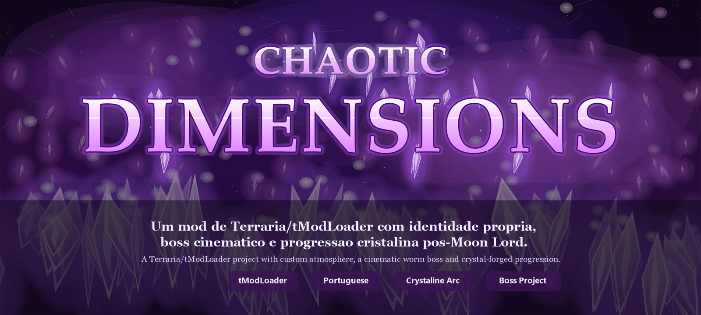
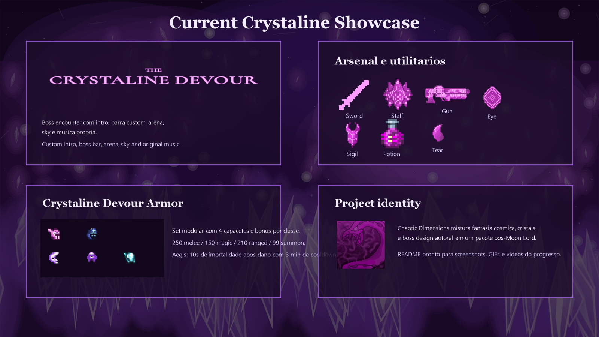
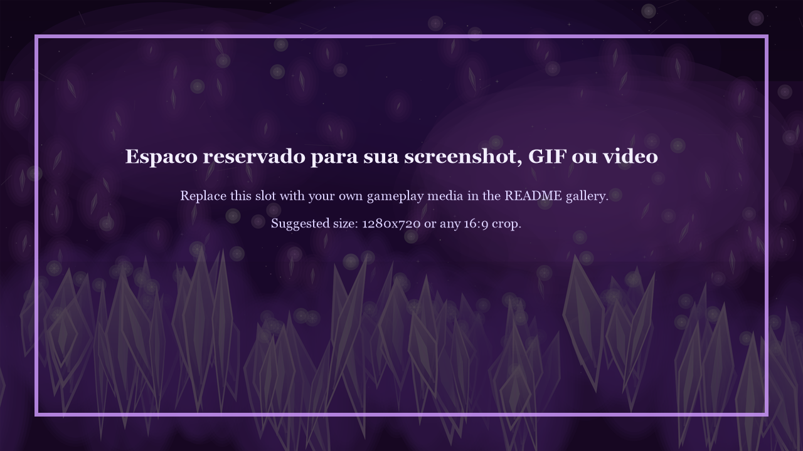

<div align="center">
  
</div>

<p align="center">
  <strong>Chaotic Dimensions</strong> e um mod autoral para <strong>Terraria / tModLoader</strong>, criado como projeto de TCC em Portugal e focado em atmosfera cosmica, cristais, encontros cinematograficos e conteudo pos-Moon Lord.
  <br />
  <em>Chaotic Dimensions is an original Terraria / tModLoader mod project focused on crystal-cosmic atmosphere, cinematic encounters and handcrafted post-Moon Lord content.</em>
</p>

<p align="center">
  
  
  
  
</p>

## Visao Geral

Chaotic Dimensions nasceu com a proposta de construir uma identidade visual e mecanica propria dentro do universo de Terraria. A ideia central do projeto e misturar fantasia cristalina, atmosfera cosmica, apresentacao estilizada e um boss principal que pareca memoravel tanto no combate quanto no impacto visual.

Atualmente o mod ja conta com boss customizado, arena tematica, ceu proprio, musica dedicada, barra de vida personalizada, itens exclusivos, armas para multiplas classes, acessorio utilitario, consumiveis e uma armadura modular inspirada no `Crystaline Devour`.

## Showcase Atual



## Conteudo Atual

### Boss Principal

**Crystaline Devour / Crystaline Devourer**

- Intro/cutscene de invocacao com title card.
- Musica propria da luta.
- Sky e coloracao tematica durante o encounter.
- Boss bar customizada.
- Arena cristalina para fechar o combate em uma area controlada.
- Padroes de ataque com pressao de projeteis, mobilidade de worm e `Sky Blaster`.
- Encontro encerrado automaticamente quando todos os jogadores morrem, limpando arena e efeitos visuais.

### Arsenal e Itens

| Item | Categoria | Estado atual | Destaque |
| --- | --- | --- | --- |
| `Crystaline Sigil` | Summon | Implementado | Invoca o boss e dispara a intro do encounter. |
| `Crystaline Tear` | Material | Implementado | Material principal da progressao cristalina. |
| `Crystaline Potion` | Consumivel | Implementado | Cura `250` de vida, melhora regeneracao e reduz o potion sickness. |
| `Crystaline Eye` | Acessorio | Implementado | `25` de defesa, bonus de mobilidade e teleporte no clique direito com impulso direcional. |
| `Crystaline Sword` | Melee | Implementado | Arma rara do boss com lamina central, espadas orbitais e sustain via cura ao acertar. |
| `Crystaline Staff` | Magic | Implementado | Disparo magico multiplo com spread cristalino. |
| `Crystaline Gun` | Ranged | Implementado | Arma extremamente rapida baseada em pressao continua de tiros. |

### Armadura Crystaline Devour

O set foi desenhado como uma armadura modular: peitoral e grevas sao compartilhados, enquanto o capacete define a classe e muda completamente o perfil do conjunto.

| Peca / Variante | Classe | Defesa total do set | Destaque |
| --- | --- | --- | --- |
| `Crystaline Devour Melee Helm` | Melee | `250` | Dano melee massivo, velocidade melee e mobilidade elevada. |
| `Crystaline Devour Magic Helm` | Magic | `150` | Dano magico extremo e custo de mana quase nulo. |
| `Crystaline Devour Ranged Helm` | Ranged | `210` | Altissima cadencia, dano ranged elevado e economia pesada de municao. |
| `Crystaline Devour Summoner Helm` | Summoner | `99` | Dano summoner absurdo, `+10` minions e bonus de mobilidade. |
| `Crystaline Devour Breastplate` | Universal | Compartilhado | Nucleo visual e defensivo da armadura. |
| `Crystaline Devour Greaves` | Universal | Compartilhado | Base do set e mobilidade complementar. |

**Bonus especial do set**

- Todos os sets ativam uma protecao de `10 segundos` de imortalidade ao receber dano.
- A protecao entra em cooldown de `3 minutos` antes de poder ativar novamente.

### Buffs e Sistemas de Suporte

| Sistema / Buff | Funcao |
| --- | --- |
| `Crystaline Potion Regeneration` | Regeneracao adicional elevada. |
| `Crystaline Potion Fortitude` | Defesa extra ao consumir a pocao. |
| `Crystaline Rush` | Velocidade e regeneracao apos o teleporte do `Crystaline Eye`. |
| `Crystaline Devour Aegis` | Estado de invulnerabilidade temporaria ligado ao set da armadura. |

## Direcao Visual

O projeto ja possui uma linha estetica propria sendo construida:

- Fundo cosmico-cristalino para o encounter do boss.
- Titulo customizado para o menu do mod.
- Preview visual da armadura `Crystaline Devour`.
- Title card exclusiva para a apresentacao do boss.

## Espaco para Screenshots, GIFs e Videos

Esta parte do README ja esta preparada para voce plugar sua midia propria conforme o projeto for evoluindo.

### Placeholder de midia



### Exemplo para screenshot

```md

```

### Exemplo para GIF

```md

```

### Exemplo para video

```md
[](https://www.youtube.com/watch?v=SEU_VIDEO)
```

### Sugestoes de blocos para galeria

Voce pode usar blocos assim no futuro:

```md
## Boss Fight Gallery


## GIF Highlights


## Trailer / Gameplay

[](https://www.youtube.com/watch?v=SEU_VIDEO)
```

## Estrutura do Projeto

```text
ChaoticDimensions/
|- Content/
|  |- BossBars/
|  |- Bosses/CrystalineDevourer/
|  |- Buffs/
|  |- Items/
|  |  |- Accessories/
|  |  |- Armor/CrystalineDevour/
|  |  |- Consumables/
|  |  |- Materials/
|  |  |- Summons/
|  |  `- Weapons/
|  |- Players/
|  |- Projectiles/
|  `- Scenes/
|- Common/
|  |- Graphics/
|  |- Menus/
|  |- Systems/
|  `- Tiles/
|- Assets/UI/
|- .github/readme/
`- tools/
```

## Compilacao Local

```powershell
dotnet build ChaoticDimensions.csproj
```

O projeto foi pensado para desenvolvimento em `tModLoader ModSources`, entao a forma mais pratica de testar e compilar e abrir o mod diretamente pelo ambiente do Terraria/tModLoader.

## Status do Projeto

- Boss principal ja jogavel.
- Arsenal cristalino base ja implementado.
- Armadura modular `Crystaline Devour` ja integrada.
- README e assets do repositorio preparados para apresentacao publica.
- Polimento visual, balanceamento fino e expansao de conteudo ainda em andamento.

## English Snapshot

Chaotic Dimensions is a crystal-cosmic post-Moon Lord Terraria/tModLoader mod project. Right now the repository already includes a custom boss encounter, themed arena and sky, custom music, weapons for multiple classes, a teleport utility accessory, consumables, buffs and a modular armor line with class-specific helmets.

This README is also prepared to receive your own screenshots, GIFs and video links as the project keeps evolving.

## Creditos

- **Projeto:** `blueDev`
- **Plataforma:** `Terraria / tModLoader`
- **Identidade do README:** assets e apresentacao preparados diretamente dentro do repositorio para facilitar showcase publico do projeto.
