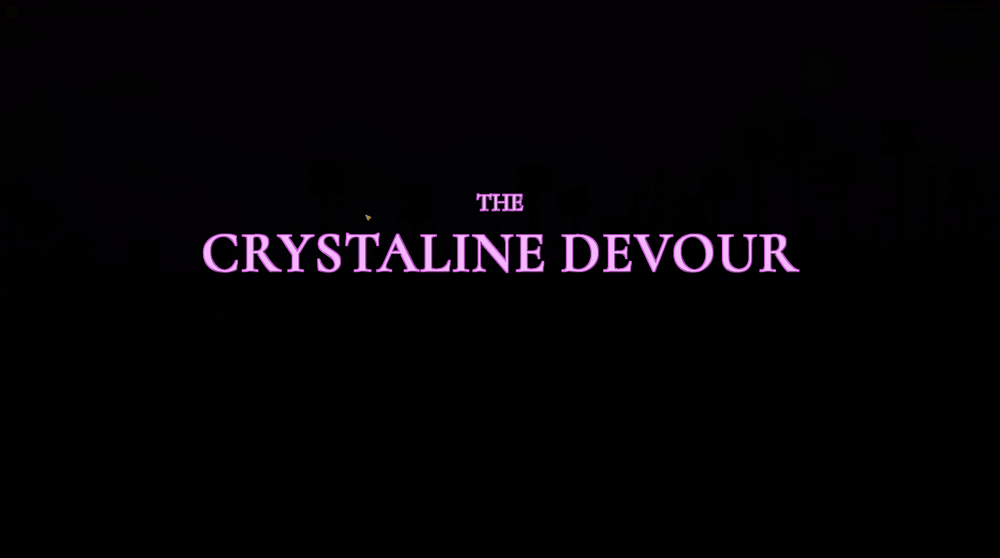
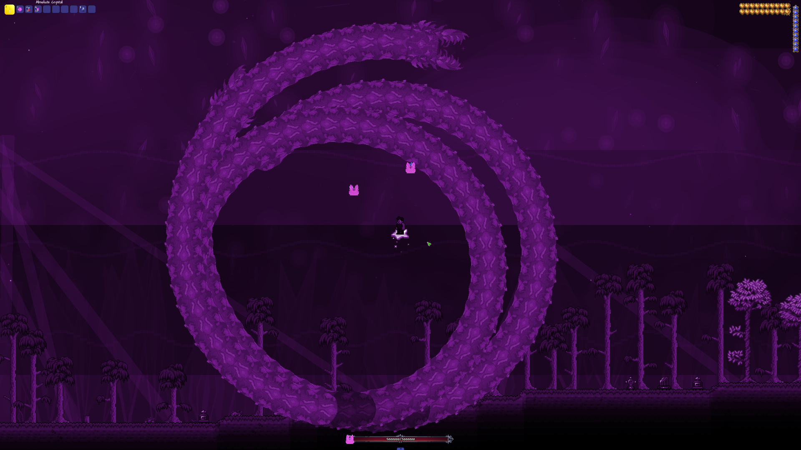
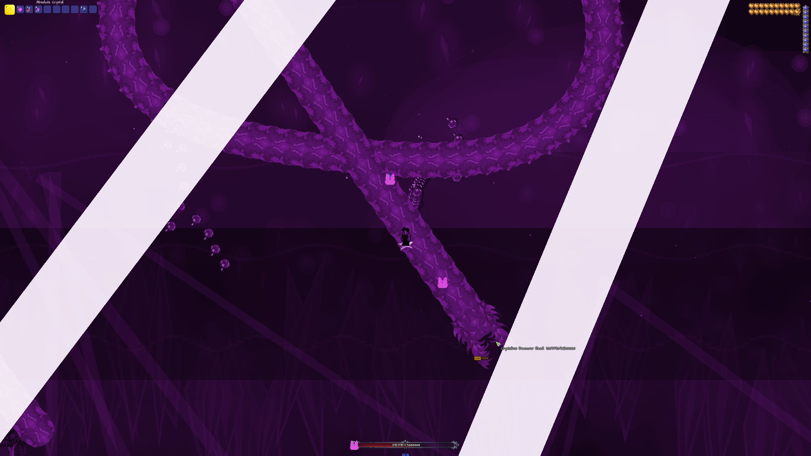

<div align="center">
  
</div>

<div align="center">
  
</div>

<p align="center">
  
  
</p>

<p align="center">
  <strong>Chaotic Dimensions</strong> e um mod autoral para <strong>Terraria / tModLoader</strong>, criado como projeto de TCC em Portugal e pensado para crescer como um universo proprio, com varios bosses, progressoes, biomas, dimensoes e encounters com identidade forte.
  <br />
  <em>Chaotic Dimensions is an original Terraria / tModLoader project designed to grow into its own universe, with multiple bosses, handcrafted progression, new biomes, dimensions and high-identity encounters.</em>
</p>

<p align="center">
  
  
  
  
  
</p>

## Sobre o Projeto

Chaotic Dimensions nasceu para ser mais do que um unico boss ou um unico arco de conteudo. A ideia do projeto e construir uma linha propria dentro do universo de Terraria: direcao visual forte, atmosfera cosmica e cristalina, bosses marcantes, progressao autoral e uma sensacao de expansao continua.

O `Crystaline Devour` e apenas o primeiro boss oficial dessa fundacao. Ele representa o inicio da identidade do mod, nao o unico foco dela.

## Visao

- Criar varios bosses com apresentacao, mecanicas e ambientacao proprias.
- Expandir o mod com itens, armas, armaduras, acessorios e sistemas originais.
- Construir encounters com intro, musica, boss bar, sky e arena personalizados.
- Misturar fantasia cristalina, escala cosmica e estilo autoral em uma progressao pos-Moon Lord.

## Fundacoes Ja Implementadas

Atualmente o projeto ja possui a primeira base jogavel do universo `Chaotic Dimensions`:

- Primeiro boss oficial: `Crystaline Devour / Crystaline Devourer`.
- Intro/cutscene para invocacao do encounter.
- Boss bar customizada.
- Musica propria da luta.
- Sky e coloracao tematica durante o combate.
- Arena cristalina para controlar o encontro.
- Arsenal cristalino inicial com armas para classes diferentes.
- Acessorios e consumiveis exclusivos.
- Armadura modular `Crystaline Devour Armor`.
- Sistemas de buffs e efeitos especiais ligados a equipamentos.

## Primeiro Marco Oficial

O `Crystaline Devour` e o primeiro boss oficial do projeto e funciona como a primeira grande demonstracao da direcao que o mod quer seguir:

- Presenca visual forte.
- Encounter estilizado.
- Ambiente proprio.
- Progressao baseada em drops e equipamentos exclusivos.
- Base tecnica para os proximos bosses, dimensoes e sistemas do mod.

## Direcao Visual

Chaotic Dimensions esta sendo construido com foco em identidade. Isso inclui:

- Menu proprio.
- Backgrounds e skies personalizados.
- Title cards para encounters importantes.
- Armaduras e itens com linha visual dedicada.
- Apresentacao pensada para parecer parte de um universo maior.

## Estrutura do Repositorio

```text
ChaoticDimensions/
|- Content/
|  |- BossBars/
|  |- Bosses/
|  |- Buffs/
|  |- Items/
|  |- Players/
|  |- Projectiles/
|  `- Scenes/
|- Common/
|  |- Graphics/
|  |- Menus/
|  |- Systems/
|  `- Tiles/
|- Assets/
|- .github/readme/
`- tools/
```

## Compilacao Local

```powershell
dotnet build ChaoticDimensions.csproj
```

O projeto foi pensado para desenvolvimento dentro de `tModLoader ModSources`, entao o fluxo mais pratico e compilar e abrir o mod diretamente pelo ambiente do Terraria / tModLoader.

## English Snapshot

Chaotic Dimensions is an original Terraria / tModLoader mod project built to become a much larger custom universe over time. The goal is not to center everything around a single boss, but to create a broader identity with multiple bosses, handcrafted progression, original visuals and memorable encounters.

The `Crystaline Devour` is the first official boss of that vision, not the final centerpiece of the whole mod.

## Creditos

- **Projeto:** `blueDev`
- **Plataforma:** `Terraria / tModLoader`
- **README:** organizado para apresentar o projeto de forma mais ampla, sem prender o repositorio a um unico boss ou a uma lista de itens temporaria.
